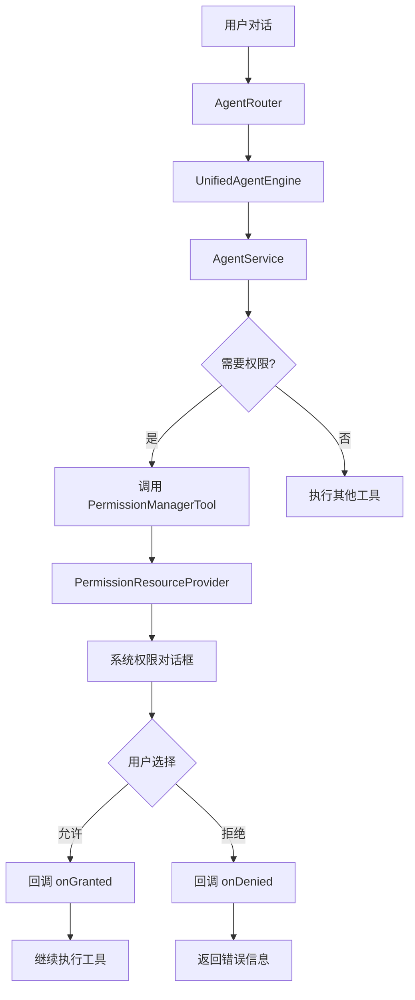

# Agent 权限管理机制详解

## 📋 目录
1. [Agent 权限请求架构](#agent-权限请求架构)
2. [PermissionManagerTool 工具](#permissionmanagertool-工具)
3. [权限管理工具工作原理](#权限管理工具工作原理)
4. [实际应用案例](#实际应用案例)
5. [最佳实践建议](#最佳实践建议)

---

## 🏗️ Agent 权限请求架构

### 整体设计



### 核心组件

| 组件 | 职责 | 文件位置 |
|------|------|---------|
| **AgentRouter** | 路由 Agent 请求到本地或在线引擎 | `ai/agent/AgentRouter.java` |
| **UnifiedAgentEngine** | 统一 Agent 执行引擎 | `ai/agent/UnifiedAgentEngine.java` |
| **AgentService** | Agent 服务层，管理工具调用 | `ai/service/AgentService.java` |
| **PermissionManagerTool** | 权限管理工具（AI Tool） | `ai/tool/PermissionManagerTool.java` |
| **PermissionResourceProvider** | 权限资源提供者（底层工具） | `resource/PermissionResourceProvider.java` |

---

## 🔧 PermissionManagerTool 工具

### 工具定义

**文件**: [PermissionManagerTool.java](file://d:\qzq\smartquiz\src\main\java\com\oilquiz\app\ai\tool\PermissionManagerTool.java)

```java
@AIToolDefinition(
    name = "permission_manager",
    description = "权限管理工具，用于检查和请求Android应用权限",
    actions = {
        @Action(name = "check", description = "检查权限状态"),
        @Action(name = "request", description = "请求权限（异步）"),
        @Action(name = "request_and_wait", description = "请求权限并等待结果（同步阻塞）"),
        @Action(name = "list_all", description = "列出所有可用权限")
    }
)
public class PermissionManagerTool implements AITool {
    // ...
}
```

### 核心功能

#### 1. check - 检查权限状态

**用途**：查询某个权限是否已授予

**示例调用**：
```json
{
  "tool": "permission_manager",
  "action": "check",
  "parameters": {
    "permission": "录音"
  }
}
```

**实现逻辑**：
```java
private AIToolResult checkPermission(Map<String, Object> parameters) {
    String permission = (String) parameters.get("permission");
    String androidPermission = getAndroidPermission(permission); // "录音" → RECORD_AUDIO
    
    int result = context.checkSelfPermission(androidPermission);
    boolean granted = result == PackageManager.PERMISSION_GRANTED;
    
    Map<String, Object> resultMap = new HashMap<>();
    resultMap.put("status", "success");
    resultMap.put("permission", permission);
    resultMap.put("granted", granted);
    resultMap.put("message", granted ? "权限已授予" : "权限未授予");
    
    return new AIToolResult(resultMap, parameters);
}
```

**返回结果**：
```json
{
  "status": "success",
  "permission": "录音",
  "androidPermission": "android.permission.RECORD_AUDIO",
  "granted": false,
  "message": "权限未授予"
}
```

---

#### 2. request - 请求权限（异步）

**用途**：弹出权限对话框，不等待结果

**示例调用**：
```json
{
  "tool": "permission_manager",
  "action": "request",
  "parameters": {
    "permission": "录音"
  }
}
```

**实现逻辑**：
```java
private AIToolResult requestPermission(Map<String, Object> parameters) {
    String permission = (String) parameters.get("permission");
    String androidPermission = getAndroidPermission(permission);
    
    // 1. 检查是否已授权
    int result = context.checkSelfPermission(androidPermission);
    if (result == PackageManager.PERMISSION_GRANTED) {
        return new AIToolResult("权限已授予", parameters);
    }
    
    // 2. 获取当前 Activity
    Activity activity = SmartQuizApplication.getCurrentActivity();
    if (activity == null) {
        return new AIToolResult("没有可用的 Activity，无法弹出权限请求对话框", parameters);
    }
    
    // 3. 使用 PermissionResourceProvider 请求权限
    PermissionResourceProvider provider = PermissionResourceProvider.getInstance(context);
    
    mainHandler.post(() -> {
        provider.requestPermission(activity, androidPermission, new PermissionCallback() {
            @Override
            public void onGranted() {
                AILogger.i(TAG, "权限请求成功: " + permission);
            }
            
            @Override
            public void onDenied(List<String> deniedPermissions) {
                AILogger.w(TAG, "权限请求被拒绝: " + permission);
            }
        });
    });
    
    // 4. 立即返回（不等待结果）
    Map<String, Object> resultMap = new HashMap<>();
    resultMap.put("status", "success");
    resultMap.put("requested", true);
    resultMap.put("message", "已弹出权限请求对话框，请等待用户授权");
    resultMap.put("suggestion", "使用 request_and_wait action 可以等待授权结果");
    
    return new AIToolResult(resultMap, parameters);
}
```

**特点**：
- ✅ 非阻塞，立即返回
- ✅ 适合 Agent 多轮对话场景
- ⚠️ 无法立即知道用户是否授权

---

#### 3. request_and_wait - 请求权限并等待（同步阻塞）

**用途**：弹出权限对话框，等待用户选择后返回结果

**示例调用**：
```json
{
  "tool": "permission_manager",
  "action": "request_and_wait",
  "parameters": {
    "permission": "录音",
    "timeout_ms": 30000
  }
}
```

**实现逻辑**：
```java
private AIToolResult requestPermissionAndWait(Map<String, Object> parameters) {
    String permission = (String) parameters.get("permission");
    String androidPermission = getAndroidPermission(permission);
    
    // 1. 检查是否已授权
    int result = context.checkSelfPermission(androidPermission);
    if (result == PackageManager.PERMISSION_GRANTED) {
        return new AIToolResult("权限已授予", parameters);
    }
    
    // 2. 获取当前 Activity
    Activity activity = SmartQuizApplication.getCurrentActivity();
    if (activity == null) {
        return new AIToolResult("没有可用的 Activity", parameters);
    }
    
    // 3. 使用 CountDownLatch 等待结果
    final CountDownLatch latch = new CountDownLatch(1);
    final AtomicBoolean granted = new AtomicBoolean(false);
    final PermissionResourceProvider provider = PermissionResourceProvider.getInstance(context);
    
    mainHandler.post(() -> {
        provider.requestPermission(activity, androidPermission, new PermissionCallback() {
            @Override
            public void onGranted() {
                granted.set(true);
                latch.countDown(); // 释放锁
            }
            
            @Override
            public void onDenied(List<String> deniedPermissions) {
                granted.set(false);
                latch.countDown(); // 释放锁
            }
        });
    });
    
    // 4. 阻塞等待（最多30秒）
    try {
        boolean completed = latch.await(30000, TimeUnit.MILLISECONDS);
        
        if (!completed) {
            // 超时
            return new AIToolResult("权限请求超时", parameters);
        } else {
            // 完成
            if (granted.get()) {
                return new AIToolResult("权限请求成功", parameters);
            } else {
                // 检测是否"不再询问"
                boolean shouldShowRationale = activity.shouldShowRequestPermissionRationale(androidPermission);
                if (!shouldShowRationale) {
                    return new AIToolResult("权限被拒绝且用户选择了不再询问，请去设置页面手动授权", parameters);
                }
                return new AIToolResult("权限请求被用户拒绝", parameters);
            }
        }
    } catch (InterruptedException e) {
        return new AIToolResult("权限请求被中断", parameters);
    }
}
```

**特点**：
- ✅ 阻塞等待，直到用户做出选择
- ✅ 返回明确的授权结果
- ✅ 检测"不再询问"状态
- ⚠️ 会阻塞 Agent 执行线程

---

### 权限名称映射

```java
private static final Map<String, String> PERMISSION_MAP = new HashMap<>();

static {
    PERMISSION_MAP.put("存储", Manifest.permission.READ_EXTERNAL_STORAGE);
    PERMISSION_MAP.put("相机", Manifest.permission.CAMERA);
    PERMISSION_MAP.put("录音", Manifest.permission.RECORD_AUDIO);
    PERMISSION_MAP.put("麦克风", Manifest.permission.RECORD_AUDIO);
    PERMISSION_MAP.put("位置", Manifest.permission.ACCESS_FINE_LOCATION);
    PERMISSION_MAP.put("联系人", Manifest.permission.READ_CONTACTS);
    PERMISSION_MAP.put("电话", Manifest.permission.READ_PHONE_STATE);
    // ... 更多映射
}

private String getAndroidPermission(String permissionName) {
    return PERMISSION_MAP.get(permissionName);
}
```

**支持的权限名称**：
| 中文名称 | Android 权限常量 |
|---------|-----------------|
| 存储 | `READ_EXTERNAL_STORAGE` |
| 相机 | `CAMERA` |
| 录音/麦克风 | `RECORD_AUDIO` |
| 位置 | `ACCESS_FINE_LOCATION` |
| 联系人 | `READ_CONTACTS` |
| 电话 | `READ_PHONE_STATE` |
| 日历 | `READ_CALENDAR` |
| 短信 | `SEND_SMS` |

---

## 🔐 权限管理工具工作原理

### PermissionResourceProvider 核心机制

**文件**: [PermissionResourceProvider.java](file://d:\qzq\smartquiz\src\main\java\com\oilquiz\app\resource\PermissionResourceProvider.java)

#### 1. 单例模式

```java
private static PermissionResourceProvider instance;

public static synchronized PermissionResourceProvider getInstance(Context context) {
    if (instance == null) {
        instance = new PermissionResourceProvider(context);
    }
    return instance;
}
```

#### 2. 权限分组管理

```java
private Map<String, String[]> permissionGroups;

private void initPermissionGroups() {
    permissionGroups = new HashMap<>();
    
    permissionGroups.put("microphone", new String[]{
        Manifest.permission.RECORD_AUDIO
    });
    
    permissionGroups.put("location", new String[]{
        Manifest.permission.ACCESS_FINE_LOCATION,
        Manifest.permission.ACCESS_COARSE_LOCATION
    });
    
    // ... 共12个权限组
}
```

#### 3. 请求码自动管理

```java
private final AtomicInteger requestCodeCounter = new AtomicInteger(10000);
private final Map<Integer, PermissionCallback> pendingCallbacks = new HashMap<>();

private int nextRequestCode() {
    return requestCodeCounter.incrementAndGet();
}
```

**优势**：
- ✅ 无需手动定义请求码常量
- ✅ 自动递增，避免冲突
- ✅ 通过 Map 管理回调

#### 4. 权限请求流程

```java
public void requestPermission(Activity activity, String permission, PermissionCallback callback) {
    // 1. 检查是否已授权
    if (isPermissionGranted(permission)) {
        callback.onGranted();
        return;
    }
    
    // 2. 显示友好对话框
    showPermissionRequestDialog(activity, new String[]{permission}, callback);
}

private void showPermissionRequestDialog(Activity activity, String[] permissions, PermissionCallback callback) {
    // 构建友好的权限说明
    StringBuilder permissionNames = new StringBuilder();
    for (String p : permissions) {
        permissionNames.append(getPermissionFriendlyName(p)); // "录音"
    }
    
    String message = String.format("应用需要以下权限才能正常使用：%s", permissionNames.toString());
    
    new AlertDialog.Builder(activity)
        .setTitle("权限请求")
        .setMessage(message)
        .setPositiveButton("确定", (dialog, which) -> {
            executePermissionRequest(activity, permissions, callback);
        })
        .setNegativeButton("取消", (dialog, which) -> {
            callback.onDenied(Arrays.asList(permissions));
        })
        .show();
}

private void executePermissionRequest(Activity activity, String[] permissions, PermissionCallback callback) {
    int requestCode = nextRequestCode();
    if (callback != null) {
        pendingCallbacks.put(requestCode, callback); // 保存回调
    }
    ActivityCompat.requestPermissions(activity, permissions, requestCode);
}
```

#### 5. 结果分发

```java
public void onRequestPermissionsResult(int requestCode, String[] permissions, int[] grantResults) {
    // 1. 从 Map 中取出对应的回调
    PermissionCallback callback = pendingCallbacks.remove(requestCode);
    
    List<String> deniedPermissions = new ArrayList<>();
    
    // 2. 处理每个权限的结果
    for (int i = 0; i < permissions.length; i++) {
        if (grantResults[i] == PackageManager.PERMISSION_GRANTED) {
            // 授权成功
            if (permissionRequestListener != null) {
                permissionRequestListener.onPermissionGranted(permissions[i]);
            }
        } else {
            // 授权失败
            deniedPermissions.add(permissions[i]);
            if (permissionRequestListener != null) {
                permissionRequestListener.onPermissionDenied(permissions[i]);
            }
        }
    }
    
    // 3. 调用回调
    if (deniedPermissions.isEmpty()) {
        if (callback != null) {
            callback.onGranted();
        }
    } else {
        if (callback != null) {
            callback.onDenied(deniedPermissions);
        }
    }
}
```

#### 6. 同步阻塞请求（ensurePermission）

```java
public PermissionRequestResult ensurePermission(String permission, long timeoutMs) {
    final PermissionRequestResult result = new PermissionRequestResult();
    
    // 1. 检查是否已授权
    if (isPermissionGranted(permission)) {
        result.success = true;
        result.granted = true;
        return result;
    }
    
    // 2. 获取当前 Activity
    Activity activity = SmartQuizApplication.getCurrentActivity();
    if (activity == null) {
        result.success = false;
        result.errorMessage = "没有可用的 Activity";
        return result;
    }
    
    // 3. 使用 CountDownLatch 等待
    final CountDownLatch latch = new CountDownLatch(1);
    final AtomicBoolean granted = new AtomicBoolean(false);
    
    mainHandler.post(() -> {
        requestPermission(activity, permission, new PermissionCallback() {
            @Override
            public void onGranted() {
                granted.set(true);
                latch.countDown();
            }
            
            @Override
            public void onDenied(List<String> deniedPermissions) {
                granted.set(false);
                latch.countDown();
            }
        });
    });
    
    // 4. 阻塞等待
    try {
        boolean completed = latch.await(timeoutMs, TimeUnit.MILLISECONDS);
        
        if (!completed) {
            result.timeout = true;
            result.errorMessage = "权限请求超时";
        } else {
            result.granted = granted.get();
        }
    } catch (InterruptedException e) {
        result.errorMessage = "权限请求被中断";
    }
    
    return result;
}
```

---

## 📱 实际应用案例

### 案例1：LocationTool 获取位置

**文件**: [LocationTool.java](file://d:\qzq\smartquiz\src\main\java\com\oilquiz\app\ai\tool\LocationTool.java)

```java
@Action(name = "get_current_location", description = "获取当前位置")
public AIToolResult getCurrentLocation(Map<String, Object> parameters) {
    // 1. 检查位置服务是否开启
    LocationManager locationManager = (LocationManager) context.getSystemService(Context.LOCATION_SERVICE);
    if (!locationManager.isProviderEnabled(LocationManager.GPS_PROVIDER)) {
        return new AIToolResult("请先在系统设置中开启位置服务", parameters);
    }
    
    // 2. 使用 ensureLocationPermission 同步请求权限
    PermissionResourceProvider.PermissionRequestResult permResult = 
        PermissionResourceProvider.getInstance(context).ensureLocationPermission(30000);
    
    if (!permResult.granted) {
        AILogger.w(TAG, "Location permission check failed: " + permResult.errorMessage);
        
        // 3. 如果没有 Activity，引导用户去设置页面
        if (!permResult.hasActivity) {
            showToast("需要位置权限才能获取定位，请在应用设置中授权");
            context.startActivity(buildAppSettingsIntent());
            return new AIToolResult("请前往设置页面授权位置权限", parameters);
        }
        
        return new AIToolResult("位置权限被拒绝: " + permResult.errorMessage, parameters);
    }
    
    // 4. 权限已授予，获取位置
    Location location = getLastKnownLocation();
    if (location != null) {
        Map<String, Object> result = new HashMap<>();
        result.put("latitude", location.getLatitude());
        result.put("longitude", location.getLongitude());
        result.put("accuracy", location.getAccuracy());
        return new AIToolResult(result, parameters);
    }
    
    return new AIToolResult("无法获取位置信息", parameters);
}
```

**工作流程**：
```
用户问："我在哪里？"
    ↓
Agent 识别意图 → 调用 LocationTool.getCurrentLocation()
    ↓
检查位置服务 → 已开启
    ↓
ensureLocationPermission(30000)
    ↓
├─ 已授权 → 直接获取位置
└─ 未授权 → 弹出权限对话框
              ↓
         用户点击"允许"
              ↓
         返回位置信息
```

---

### 案例2：AIChatActivity 录音功能

**文件**: [AIChatActivity.java](file://d:\qzq\smartquiz\src\main\java\com\oilquiz\app\ui\activity\AIChatActivity.java)

```java
private void handleRecordAudio() {
    if (isRecording) {
        stopRecording();
    } else {
        // ✅ 使用统一的权限管理工具
        PermissionResourceProvider provider = PermissionResourceProvider.getInstance(this);
        
        provider.requestMicrophonePermission(this, new PermissionCallback() {
            @Override
            public void onGranted() {
                startRecording(); // 权限已授予，开始录音
            }
            
            @Override
            public void onDenied(List<String> deniedPermissions) {
                showToast("❌ 需要录音权限才能使用语音功能");
                
                // 检测"不再询问"
                if (!provider.shouldShowRequestPermissionRationale(
                        AIChatActivity.this, Manifest.permission.RECORD_AUDIO)) {
                    showPermissionSettingsDialog(); // 引导去设置
                }
            }
        });
    }
}
```

---

## 💡 最佳实践建议

### 1. Agent 工具中推荐使用 request_and_wait

**原因**：
- Agent 需要明确知道权限是否授予
- 阻塞等待确保后续操作能正常执行

**示例**：
```java
// ✅ 推荐
AIToolResult result = permissionTool.execute("request_and_wait", params);
if (result.data.get("granted") == true) {
    // 继续执行
} else {
    // 提示用户
}

// ❌ 不推荐
permissionTool.execute("request", params); // 无法立即知道结果
```

### 2. UI 层推荐使用异步 request

**原因**：
- 不阻塞主线程
- 用户体验更好

**示例**：
```java
// ✅ 推荐（AIChatActivity）
provider.requestMicrophonePermission(this, new PermissionCallback() {
    @Override
    public void onGranted() {
        startRecording();
    }
});

// ❌ 不推荐
PermissionRequestResult result = provider.ensurePermission(RECORD_AUDIO); // 阻塞UI线程
```

### 3. 始终检查 hasActivity

**原因**：
- 后台服务或 Broadcast Receiver 中没有 Activity
- 无法弹出权限对话框

**示例**：
```java
PermissionRequestResult result = provider.ensurePermission(permission);

if (!result.hasActivity) {
    // 引导用户去设置页面
    Intent intent = new Intent(Settings.ACTION_APPLICATION_DETAILS_SETTINGS);
    intent.setData(Uri.parse("package:" + packageName));
    context.startActivity(intent);
    return;
}
```

### 4. 处理"不再询问"状态

**原因**：
- 用户选择"不再询问"后，`requestPermissions()` 不会弹窗
- 需要引导用户手动去设置页面

**示例**：
```java
provider.requestPermission(activity, permission, new PermissionCallback() {
    @Override
    public void onDenied(List<String> denied) {
        if (!provider.shouldShowRequestPermissionRationale(activity, permission)) {
            // 用户选择了"不再询问"
            showSettingsDialog();
        } else {
            // 用户只是拒绝，可以再次请求
            showToast("权限被拒绝");
        }
    }
});
```

### 5. 使用权限组简化代码

**示例**：
```java
// ✅ 推荐：使用权限组
provider.requestPermissionGroup(activity, "microphone", callback);

// ❌ 不推荐：手动指定权限
provider.requestPermission(activity, Manifest.permission.RECORD_AUDIO, callback);
```

---

## 📊 总结对比

### 三种权限请求方式对比

| 方式 | 适用场景 | 优点 | 缺点 |
|------|---------|------|------|
| **check** | 仅查询权限状态 | 快速、无副作用 | 无法请求权限 |
| **request** | UI层异步请求 | 不阻塞、体验好 | 无法立即知道结果 |
| **request_and_wait** | Agent工具同步请求 | 结果明确、可判断 | 阻塞线程 |
| **ensurePermission** | 后台线程同步请求 | 支持超时、返回值完整 | 需处理超时 |

### 权限管理工具层级

```
┌─────────────────────────────────────┐
│   Agent 层                           │
│   - PermissionManagerTool           │
│     • check                         │
│     • request                       │
│     • request_and_wait              │
└──────────────┬──────────────────────┘
               │ 调用
┌──────────────▼──────────────────────┐
│   工具层                             │
│   - LocationTool                    │
│   - CameraTool                      │
│   - StorageTool                     │
│     内部调用 ensurePermission       │
└──────────────┬──────────────────────┘
               │ 调用
┌──────────────▼──────────────────────┐
│   基础设施层                         │
│   - PermissionResourceProvider      │
│     • requestPermission             │
│     • ensurePermission              │
│     • onRequestPermissionsResult    │
└──────────────┬──────────────────────┘
               │ 调用
┌──────────────▼──────────────────────┐
│   Android 系统                       │
│   - ActivityCompat                  │
│   - ContextCompat                   │
└─────────────────────────────────────┘
```

---

## 🔗 相关文档

- [PERMISSION_MANAGEMENT_UNIFICATION_FIX.md](file://d:\qzq\smartquiz\docs\development\PERMISSION_MANAGEMENT_UNIFICATION_FIX.md) - 权限管理统一化修复
- [FIX_RECORD_AUDIO_PERMISSION.md](file://d:\qzq\smartquiz\docs\development\FIX_RECORD_AUDIO_PERMISSION.md) - 录音权限修复报告
- [PERMISSION_AND_VOICE_FEATURES_ANALYSIS.md](file://d:\qzq\smartquiz\docs\development\PERMISSION_AND_VOICE_FEATURES_ANALYSIS.md) - 权限与语音功能分析

---

## ✨ 核心价值

1. **统一管理**：全项目使用同一套权限管理工具
2. **分层设计**：Agent 层 → 工具层 → 基础设施层，职责清晰
3. **灵活选择**：提供同步/异步、阻塞/非阻塞多种方式
4. **健壮性**：自动处理"不再询问"、超时、无 Activity 等边界情况
5. **易用性**：中文权限名称映射，降低使用门槛

Agent 权限管理机制已完善，可以安全使用！🎉
