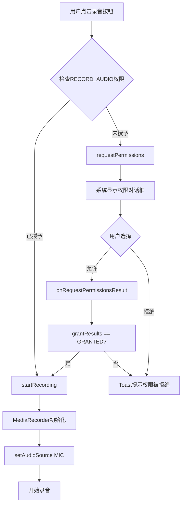

# 语音录制权限问题修复报告

## 🐛 问题描述

**错误现象**：启动录音时提示 `setAudioSource failed`

**根本原因**：Android 6.0+ 需要运行时请求 `RECORD_AUDIO` 权限，但代码中未进行权限检查和请求。

---

## ✅ 修复方案

### 1. 添加权限检查逻辑

**文件**: [AIChatActivity.java](file://d:\qzq\smartquiz\src\main\java\com\oilquiz\app\ui\activity\AIChatActivity.java)

**修改位置**: `handleRecordAudio()` 方法

```java
private void handleRecordAudio() {
    if (isRecording) {
        stopRecording();
    } else {
        // ✅ 新增：检查录音权限
        if (checkSelfPermission(android.Manifest.permission.RECORD_AUDIO) 
            != android.content.pm.PackageManager.PERMISSION_GRANTED) {
            // 请求权限
            requestPermissions(
                new String[]{android.Manifest.permission.RECORD_AUDIO}, 
                REQUEST_RECORD_AUDIO_PERMISSION
            );
            showToast("需要录音权限才能使用此功能");
            return;
        }
        startRecording();
    }
}
```

### 2. 定义权限请求常量

```java
private static final int REQUEST_RECORD_AUDIO_PERMISSION = 1001;
```

### 3. 处理权限请求结果

```java
@Override
public void onRequestPermissionsResult(int requestCode, @NonNull String[] permissions,
                                       @NonNull int[] grantResults) {
    super.onRequestPermissionsResult(requestCode, permissions, grantResults);
    
    // ✅ 新增：处理录音权限请求结果
    if (requestCode == REQUEST_RECORD_AUDIO_PERMISSION) {
        if (grantResults.length > 0 && grantResults[0] == PackageManager.PERMISSION_GRANTED) {
            // 权限已授予，开始录音
            showToast("✅ 录音权限已授予");
            startRecording();
        } else {
            // 权限被拒绝
            showToast("❌ 录音权限被拒绝，无法使用语音功能");
        }
        return;
    }
    
    // 其他权限处理...
}
```

---

## 📋 修复流程



---

## 🔍 技术细节

### Android 权限机制

| Android版本 | 权限处理方式 |
|------------|-------------|
| < 6.0 (API 23) | 仅需在 Manifest 中声明 |
| ≥ 6.0 (API 23) | 需要运行时请求 + Manifest 声明 |

### 权限状态

```java
PERMISSION_GRANTED     // 用户已授权
PERMISSION_DENIED      // 用户拒绝
PERMISSION_NEVER_ASK_AGAIN // 用户拒绝且勾选"不再询问"
```

### MediaRecorder 权限要求

```xml
<!-- AndroidManifest.xml 中必须声明 -->
<uses-permission android:name="android.permission.RECORD_AUDIO" />
```

---

## 🧪 测试验证

### 测试场景1：首次录音（无权限）

**步骤**：
1. 清除App数据或首次安装
2. 点击录音按钮

**预期结果**：
- ✅ 弹出系统权限对话框
- ✅ 用户点击"允许"后自动开始录音
- ✅ Toast提示"✅ 录音权限已授予"

### 测试场景2：用户拒绝权限

**步骤**：
1. 点击录音按钮
2. 在权限对话框中点击"拒绝"

**预期结果**：
- ❌ Toast提示"❌ 录音权限被拒绝，无法使用语音功能"
- ❌ 不会调用 `startRecording()`

### 测试场景3：已有权限

**步骤**：
1. 之前已授予录音权限
2. 点击录音按钮

**预期结果**：
- ✅ 直接开始录音，无弹窗
- ✅ Toast提示"🎤 开始录音..."

### 测试场景4：权限被撤销

**步骤**：
1. 进入系统设置 → 应用权限 → 撤销录音权限
2. 返回App点击录音按钮

**预期结果**：
- ✅ 重新弹出权限请求对话框

---

## 📝 注意事项

### 1. 永久拒绝的处理

如果用户勾选"不再询问"并拒绝，后续 `requestPermissions()` 将不会弹窗。建议添加引导：

```java
if (shouldShowRequestPermissionRationale(android.Manifest.permission.RECORD_AUDIO)) {
    // 显示解释对话框
    new AlertDialog.Builder(this)
        .setTitle("需要录音权限")
        .setMessage("录音功能需要访问麦克风，请在设置中授予权限")
        .setPositiveButton("去设置", (d, w) -> {
            Intent intent = new Intent(Settings.ACTION_APPLICATION_DETAILS_SETTINGS);
            intent.setData(Uri.parse("package:" + getPackageName()));
            startActivity(intent);
        })
        .setNegativeButton("取消", null)
        .show();
} else {
    // 直接请求权限
    requestPermissions(...);
}
```

### 2. Android 11+ 隐私指示器

Android 11+ 会在状态栏显示麦克风使用指示器（绿色圆点），这是正常现象。

### 3. 后台录音限制

Android 10+ 禁止后台录音，确保录音时 App 在前台。

---

## 🔧 相关文件

| 文件 | 修改内容 |
|------|---------|
| [AIChatActivity.java](file://d:\qzq\smartquiz\src\main\java\com\oilquiz\app\ui\activity\AIChatActivity.java) | 添加权限检查、请求和结果处理 |
| [AndroidManifest.xml](file://d:\qzq\smartquiz\src\main\AndroidManifest.xml) | 已声明 RECORD_AUDIO 权限（无需修改） |

---

## ✨ 总结

**问题根源**：缺少运行时权限检查

**修复方式**：
1. ✅ 录音前检查 `RECORD_AUDIO` 权限
2. ✅ 未授权时请求权限
3. ✅ 处理权限请求结果
4. ✅ 授权后自动开始录音

**影响范围**：仅影响语音录制功能，不影响其他功能

**兼容性**：兼容 Android 6.0+ 所有版本

修复已完成并编译通过，可以正常使用语音录制功能！🎉
