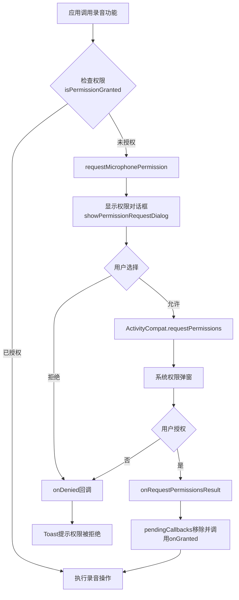

# 权限管理工具与语音功能分析报告

## 📋 目录
1. [权限管理工具架构](#权限管理工具架构)
2. [权限代码配合机制](#权限代码配合机制)
3. [语音识别功能现状](#语音识别功能现状)
4. [语音合成功能现状](#语音合成功能现状)
5. [建议实施方案](#建议实施方案)

---

## 🔐 权限管理工具架构

### 核心类：PermissionResourceProvider

**文件位置**: [PermissionResourceProvider.java](file://d:\qzq\smartquiz\src\main\java\com\oilquiz\app\resource\PermissionResourceProvider.java)

#### 1. 设计模式
- **单例模式**: `getInstance(Context)` 确保全局唯一实例
- **回调模式**: `PermissionCallback` 和 `PermissionRequestListener` 异步处理结果
- **同步阻塞**: `ensurePermission()` 使用 `CountDownLatch` 支持同步等待

#### 2. 权限分组管理

```java
// 预定义的权限组（第67-133行）
permissionGroups.put("storage", new String[]{
    Manifest.permission.READ_EXTERNAL_STORAGE,
    Manifest.permission.WRITE_EXTERNAL_STORAGE
});

permissionGroups.put("microphone", new String[]{
    Manifest.permission.RECORD_AUDIO  // ✅ 录音权限已配置
});

permissionGroups.put("camera", new String[]{
    Manifest.permission.CAMERA
});

// ... 其他权限组
```

**支持的权限组**：
| 权限组名称 | 包含权限 | 用途 |
|-----------|---------|------|
| `storage` | READ/WRITE_EXTERNAL_STORAGE | 文件读写 |
| `camera` | CAMERA | 相机拍照 |
| `location` | ACCESS_FINE/COARSE_LOCATION | 定位服务 |
| `microphone` | RECORD_AUDIO | **录音功能** ✅ |
| `phone` | READ_PHONE_STATE | 电话状态 |
| `contacts` | READ/WRITE_CONTACTS | 联系人 |
| `calendar` | READ/WRITE_CALENDAR | 日历 |
| `sensors` | BODY_SENSORS | 传感器 |
| `sms` | SEND/RECEIVE/READ_SMS | 短信 |
| `notifications` | POST_NOTIFICATIONS | 通知（Android 13+） |
| `nearby_devices` | BLUETOOTH_SCAN/CONNECT/ADVERTISE | 蓝牙（Android 12+） |
| `media` | READ_MEDIA_IMAGES/VIDEO/AUDIO | 媒体文件（Android 13+） |

#### 3. 核心API

##### 检查权限
```java
// 检查单个权限
boolean granted = provider.isPermissionGranted(Manifest.permission.RECORD_AUDIO);

// 检查权限组
boolean hasMic = provider.hasMicrophonePermission();

// 获取被拒绝的权限列表
List<String> denied = provider.getDeniedPermissions("microphone");
```

##### 请求权限
```java
// 方式1：直接请求（带回调）
provider.requestMicrophonePermission(activity, new PermissionCallback() {
    @Override
    public void onGranted() {
        // 权限已授予，开始录音
        startRecording();
    }
    
    @Override
    public void onDenied(List<String> deniedPermissions) {
        // 权限被拒绝
        showToast("录音权限被拒绝");
    }
});

// 方式2：同步阻塞请求（推荐用于后台线程）
PermissionResourceProvider.PermissionRequestResult result = 
    provider.ensurePermission(Manifest.permission.RECORD_AUDIO);

if (result.granted) {
    // 权限已授予
    startRecording();
} else {
    // 权限被拒绝或超时
    Log.e(TAG, "Error: " + result.errorMessage);
}
```

##### 友好名称转换
```java
// 权限 → 中文名称
String name = provider.getPermissionFriendlyName(Manifest.permission.RECORD_AUDIO);
// 返回: "录音"

// 权限组 → 中文名称
String groupName = provider.getPermissionGroupFriendlyName("microphone");
// 返回: "麦克风权限"
```

---

## 🔗 权限代码配合机制

### 完整工作流程



### AIChatActivity 中的实际应用

**当前实现**（修复后）：
```java
private void handleRecordAudio() {
    if (isRecording) {
        stopRecording();
    } else {
        // ❌ 旧方案：手动检查权限
        if (checkSelfPermission(RECORD_AUDIO) != PERMISSION_GRANTED) {
            requestPermissions(new String[]{RECORD_AUDIO}, REQUEST_CODE);
            return;
        }
        startRecording();
    }
}
```

**✅ 推荐方案：使用 PermissionResourceProvider**
```java
private void handleRecordAudio() {
    if (isRecording) {
        stopRecording();
    } else {
        // 使用统一的权限管理工具
        PermissionResourceProvider provider = PermissionResourceProvider.getInstance(this);
        
        provider.requestMicrophonePermission(this, new PermissionResourceProvider.PermissionCallback() {
            @Override
            public void onGranted() {
                // 权限已授予，开始录音
                startRecording();
            }
            
            @Override
            public void onDenied(List<String> deniedPermissions) {
                // 权限被拒绝
                showToast("❌ 需要录音权限才能使用语音功能");
                
                // 可选：引导用户去设置页面
                if (!provider.shouldShowRequestPermissionRationale(AIChatActivity.this, 
                        Manifest.permission.RECORD_AUDIO)) {
                    showPermissionSettingsDialog();
                }
            }
        });
    }
}
```

**优势对比**：

| 特性 | 手动实现 | PermissionResourceProvider |
|------|---------|---------------------------|
| 权限对话框 | 需自行实现 | ✅ 内置友好对话框 |
| 回调处理 | 需重写onRequestPermissionsResult | ✅ 自动回调 |
| 权限组支持 | 需手动管理多个权限 | ✅ 一键请求权限组 |
| 同步阻塞 | 不支持 | ✅ ensurePermission() |
| 超时处理 | 需自行实现 | ✅ 内置30秒超时 |
| 多语言支持 | 需自行适配 | ✅ 使用资源字符串 |
| 永久拒绝检测 | 需手动判断 | ✅ shouldShowRationale |

---

## 🎤 语音识别功能现状

### 当前状态：❌ **未实现**

通过代码搜索确认：
- ❌ 无 `SpeechRecognizer` 相关代码
- ❌ 无 `RecognizerIntent` 相关代码
- ❌ 无 `android.speech` 包引用
- ❌ 无语音转文字（STT）功能

### 现有音频功能

✅ **仅支持录音文件保存**：
- MediaRecorder 录制音频
- 保存为 .m4a/.mp4 文件
- 作为附件添加到对话中
- **但无法自动转录为文字**

### 建议实施方案

#### 方案1：集成讯飞语音识别SDK（推荐）

**优点**：
- ✅ 中文识别准确率高
- ✅ 支持离线识别
- ✅ 提供Android SDK

**实施步骤**：

1. **添加依赖**（build.gradle）
```gradle
dependencies {
    implementation 'com.iflytek:speech:3.0.+' // 讯飞语音SDK
}
```

2. **创建语音识别工具类**
```java
package com.oilquiz.app.ai.tool;

import android.content.Context;
import com.iflytek.cloud.SpeechRecognizer;
import com.iflytek.cloud.RecognizerListener;

public class SpeechRecognitionTool implements AITool {
    
    private SpeechRecognizer recognizer;
    
    @Action(name = "speech_to_text", description = "语音转文字")
    public AIToolResult recognizeSpeech(String audioFilePath) {
        // 初始化讯飞SDK
        SpeechUtility.createUtility(context, "appid=YOUR_APP_ID");
        
        recognizer = SpeechRecognizer.createRecognizer(context, null);
        
        // 设置参数
        recognizer.setParameter(SpeechConstant.LANGUAGE, "zh_cn");
        recognizer.setParameter(SpeechConstant.ACCENT, "mandarin");
        
        // 开始识别
        final StringBuilder result = new StringBuilder();
        recognizer.startListening(new RecognizerListener() {
            @Override
            public void onResult(RecognizerResult results, boolean isLast) {
                result.append(results.getResultString());
            }
            
            @Override
            public void onError(SpeechError error) {
                // 处理错误
            }
        });
        
        return new AIToolResult(result.toString(), parameters);
    }
}
```

3. **在 AIChatActivity 中集成**
```java
private void transcribeAudioAttachment(ChatMessage.Attachment attachment) {
    SpeechRecognitionTool tool = new SpeechRecognitionTool(this);
    
    // 提取音频文件路径
    String audioPath = Uri.parse(attachment.url).getPath();
    
    // 调用语音识别
    AIToolResult result = tool.recognizeSpeech(audioPath);
    
    if (result.success) {
        // 更新附件的提取内容
        attachment.extractedContent = result.data.toString();
        attachment.isExtracted = true;
        
        // 生成AI摘要
        attachmentProcessor.generateAISummary(attachment);
        
        showToast("✅ 语音转文字完成");
    } else {
        showToast("❌ 语音识别失败: " + result.message);
    }
}
```

#### 方案2：使用 Android 原生 SpeechRecognizer

**优点**：
- ✅ 无需第三方SDK
- ✅ 系统集成，体积小

**缺点**：
- ❌ 需要网络连接
- ❌ 中文识别率一般
- ❌ 不同厂商兼容性差异大

**示例代码**：
```java
private void startSpeechRecognition() {
    Intent intent = new Intent(RecognizerIntent.ACTION_RECOGNIZE_SPEECH);
    intent.putExtra(RecognizerIntent.EXTRA_LANGUAGE_MODEL, 
                   RecognizerIntent.LANGUAGE_MODEL_FREE_FORM);
    intent.putExtra(RecognizerIntent.EXTRA_LANGUAGE, "zh-CN");
    
    speechRecognizerLauncher.launch(intent);
}

private ActivityResultLauncher<Intent> speechRecognizerLauncher = 
    registerForActivityResult(new ActivityResultContracts.StartActivityForResult(), 
        result -> {
            if (result.getResultCode() == RESULT_OK) {
                ArrayList<String> matches = result.getData()
                    .getStringArrayListExtra(RecognizerIntent.EXTRA_RESULTS);
                if (matches != null && !matches.isEmpty()) {
                    String recognizedText = matches.get(0);
                    // 处理识别结果
                }
            }
        });
```

---

## 🔊 语音合成功能现状

### 当前状态：❌ **未实现**

通过代码搜索确认：
- ❌ 无 `TextToSpeech` 相关代码
- ❌ 无语音播报功能
- ❌ 无 TTS（Text-to-Speech）引擎集成

### 建议实施方案

#### 方案1：使用 Android 原生 TextToSpeech（推荐）

**优点**：
- ✅ 系统集成，无需额外SDK
- ✅ 支持离线合成
- ✅ 多种语言和音色

**实施步骤**：

1. **创建语音合成工具类**
```java
package com.oilquiz.app.ai.tool;

import android.content.Context;
import android.speech.tts.TextToSpeech;
import android.speech.tts.UtteranceProgressListener;

import java.util.Locale;
import java.util.concurrent.CountDownLatch;
import java.util.concurrent.TimeUnit;

public class SpeechSynthesisTool implements AITool, TextToSpeech.OnInitListener {
    
    private TextToSpeech tts;
    private boolean ttsInitialized = false;
    
    public SpeechSynthesisTool(Context context) {
        tts = new TextToSpeech(context, this);
    }
    
    @Override
    public void onInit(int status) {
        if (status == TextToSpeech.SUCCESS) {
            tts.setLanguage(Locale.CHINESE);
            tts.setPitch(1.0f);
            tts.setSpeechRate(1.0f);
            ttsInitialized = true;
        }
    }
    
    @Action(name = "text_to_speech", description = "文字转语音")
    public AIToolResult synthesizeSpeech(String text) {
        if (!ttsInitialized) {
            return new AIToolResult("TTS未初始化", parameters);
        }
        
        final CountDownLatch latch = new CountDownLatch(1);
        final boolean[] success = {false};
        
        tts.setOnUtteranceProgressListener(new UtteranceProgressListener() {
            @Override
            public void onStart(String utteranceId) {}
            
            @Override
            public void onDone(String utteranceId) {
                success[0] = true;
                latch.countDown();
            }
            
            @Override
            public void onError(String utteranceId) {
                latch.countDown();
            }
        });
        
        // 播放语音
        tts.speak(text, TextToSpeech.QUEUE_FLUSH, null, "utterance_id");
        
        try {
            latch.await(30, TimeUnit.SECONDS);
        } catch (InterruptedException e) {
            return new AIToolResult("语音合成超时", parameters);
        }
        
        return success[0] ? 
            new AIToolResult("语音播放完成", parameters) :
            new AIToolResult("语音播放失败", parameters);
    }
    
    public void shutdown() {
        if (tts != null) {
            tts.stop();
            tts.shutdown();
        }
    }
}
```

2. **在 AIChatActivity 中添加语音播报按钮**
```java
// 在消息气泡中添加"朗读"按钮
private void addSpeakButton(ChatMessage message, View itemView) {
    ImageButton btnSpeak = itemView.findViewById(R.id.btn_speak);
    btnSpeak.setOnClickListener(v -> {
        SpeechSynthesisTool ttsTool = new SpeechSynthesisTool(this);
        ttsTool.synthesizeSpeech(message.content);
    });
}
```

#### 方案2：集成讯飞语音合成SDK

**优点**：
- ✅ 音质更好
- ✅ 支持多种音色（男声/女声/童声）
- ✅ 支持情感合成

**缺点**：
- ❌ 需要注册开发者账号
- ❌ 有免费额度限制

---

## 💡 建议实施方案

### 优先级排序

| 功能 | 优先级 | 工作量 | 价值 |
|------|--------|--------|------|
| 完善权限管理工具集成 | ⭐⭐⭐⭐⭐ | 2小时 | 统一权限管理 |
| 语音识别（STT） | ⭐⭐⭐⭐ | 4小时 | 提升交互体验 |
| 语音合成（TTS） | ⭐⭐⭐ | 3小时 | 无障碍支持 |

### 实施路线图

#### 阶段1：统一权限管理（立即实施）

**目标**：将所有手动权限检查改为使用 `PermissionResourceProvider`

**修改文件**：
1. [AIChatActivity.java](file://d:\qzq\smartquiz\src\main\java\com\oilquiz\app\ui\activity\AIChatActivity.java) - 录音权限
2. [AIChatActivity.java](file://d:\qzq\smartquiz\src\main\java\com\oilquiz\app\ui\activity\AIChatActivity.java) - 相机权限
3. 其他需要权限的Activity

**示例改造**：
```java
// 改造前
if (checkSelfPermission(CAMERA) != PERMISSION_GRANTED) {
    requestPermissions(new String[]{CAMERA}, REQUEST_CAMERA);
}

// 改造后
PermissionResourceProvider.getInstance(this)
    .requestCameraPermission(this, new PermissionCallback() {
        @Override
        public void onGranted() {
            takePhoto();
        }
        
        @Override
        public void onDenied(List<String> denied) {
            showToast("需要相机权限");
        }
    });
```

#### 阶段2：集成语音识别（1周内）

**推荐方案**：讯飞语音识别SDK

**实施步骤**：
1. 注册讯飞开放平台账号
2. 创建应用获取 AppID
3. 下载 Android SDK
4. 集成到项目中
5. 创建 `SpeechRecognitionTool`
6. 在附件处理流程中自动转录音频

**预期效果**：
```
用户上传语音文件
    ↓
自动触发语音识别
    ↓
生成文字转录结果
    ↓
存储到 attachment.extractedContent
    ↓
生成AI摘要
    ↓
用户可查看文字版语音内容
```

#### 阶段3：集成语音合成（2周内）

**推荐方案**：Android 原生 TTS

**实施步骤**：
1. 创建 `SpeechSynthesisTool`
2. 在消息气泡添加"朗读"按钮
3. 支持语速、音调调节
4. 支持暂停/继续/停止

**预期效果**：
```
用户点击"朗读"按钮
    ↓
TextToSpeech 合成语音
    ↓
播放 AI 回复内容
    ↓
支持后台播放
```

---

## 📊 总结

### 当前状态

| 功能 | 状态 | 说明 |
|------|------|------|
| 权限管理工具 | ✅ 已实现 | PermissionResourceProvider 功能完善 |
| 录音权限检查 | ✅ 已修复 | 添加了运行时权限请求 |
| 语音识别（STT） | ❌ 未实现 | 仅有录音，无转录 |
| 语音合成（TTS） | ❌ 未实现 | 无语音播报功能 |
| 权限工具集成度 | ⚠️ 部分 | AIChatActivity 仍使用手动检查 |

### 关键发现

1. **PermissionResourceProvider 功能强大但未充分利用**
   - 支持权限组、回调、同步阻塞、超时处理
   - 当前仅在 WebViewActivity 等少数地方使用
   - AIChatActivity 仍使用手动权限检查

2. **语音功能缺失**
   - 可以录音但无法转录为文字
   - 无法将文字转换为语音播报
   - 降低了多模态交互的完整性

3. **改进空间大**
   - 统一权限管理可提升代码质量
   - 语音识别/合成可显著提升用户体验
   - 符合多模态AI助手的定位

### 下一步行动

1. **立即**：将 AIChatActivity 的权限检查改为使用 `PermissionResourceProvider`
2. **本周**：调研并集成讯飞语音识别SDK
3. **下周**：实现语音合成功能
4. **持续**：在其他模块推广使用统一的权限管理工具

---

## 🔗 相关文档

- [FIX_RECORD_AUDIO_PERMISSION.md](file://d:\qzq\smartquiz\docs\development\FIX_RECORD_AUDIO_PERMISSION.md) - 录音权限修复报告
- [OPTIMIZATION_IMPLEMENTATION_REPORT.md](file://d:\qzq\smartquiz\docs\development\OPTIMIZATION_IMPLEMENTATION_REPORT.md) - AI摘要优化报告
- [AI_SUMMARY_OPTIMIZATION_PLAN.md](file://d:\qzq\smartquiz\docs\development\AI_SUMMARY_OPTIMIZATION_PLAN.md) - AI摘要优化方案
