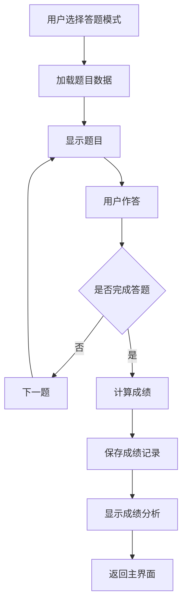
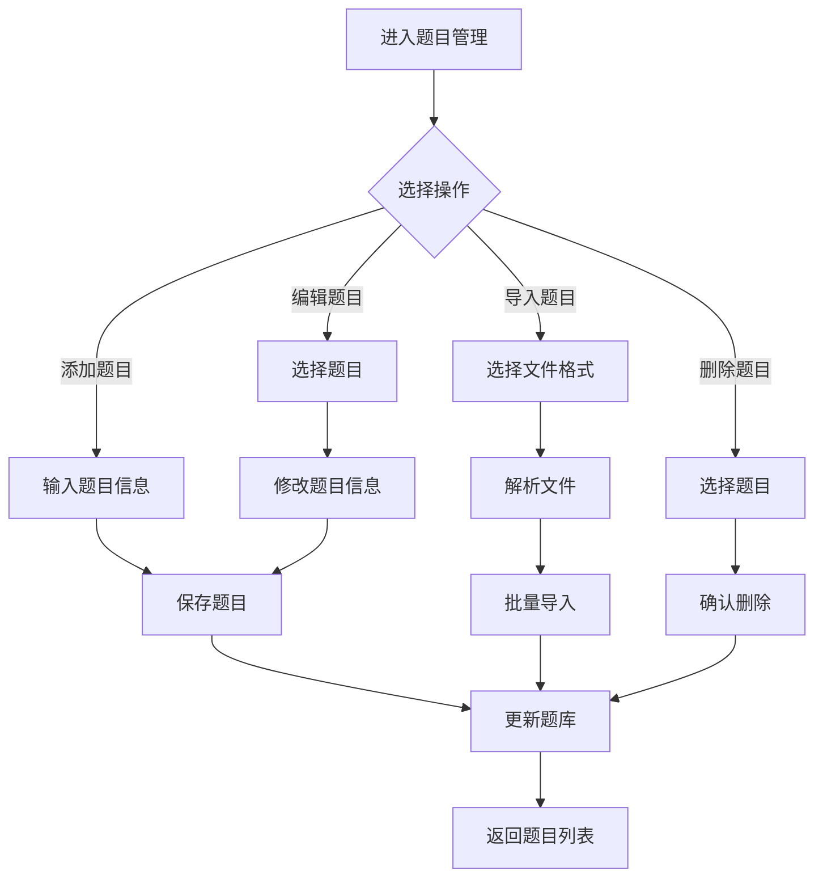
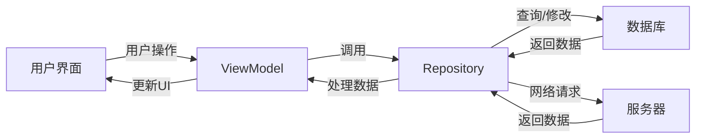
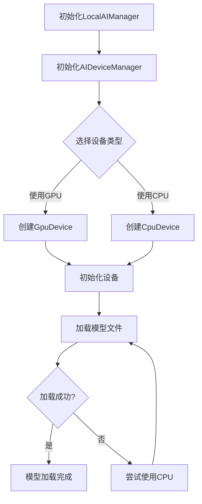
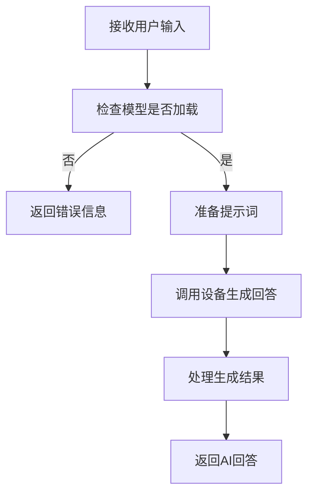
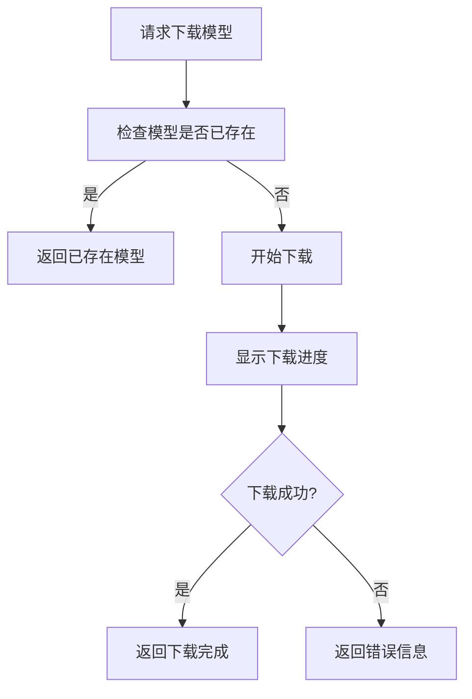

# 智能题库应用系统级标准化开发文档

## 1. 系统概述

### 1.1 系统简介

智能题库应用是一款面向学习者的移动应用，提供题目练习、题库管理、学习分析等功能。系统采用现代化的架构设计，支持多种答题模式、数据导入导出、OCR文字识别和AI辅助学习等特性。

### 1.2 系统目标

- 提供高效、便捷的学习工具
- 支持多种答题模式，满足不同学习需求
- 实现智能题库管理，包括题目导入、导出、分类等功能
- 提供个性化学习分析和建议
- 支持离线使用，确保随时随地学习
- 提供良好的用户体验和界面设计

### 1.3 系统架构

系统采用分层架构设计，包括：
- **表示层**：负责用户界面展示和交互
- **业务逻辑层**：处理核心业务逻辑
- **数据访问层**：负责数据存储和检索
- **基础设施层**：提供通用服务和工具

## 2. 系统架构设计

### 2.1 整体架构

```
┌─────────────────────────────────────────────────────────────────────┐
│                           表示层 (UI)                               │
│                                                                     │
│  Activity/Fragment → Adapter → ViewModel → Repository → Data Source  │
├─────────────────────────────────────────────────────────────────────┤
│                        业务逻辑层 (Business Logic)                   │
│                                                                     │
│  Service → Manager → Utility → Handler → Validator                  │
├─────────────────────────────────────────────────────────────────────┤
│                          数据访问层 (Data Access)                   │
│                                                                     │
│  Room Database → DAO → Entity → Migration                          │
├─────────────────────────────────────────────────────────────────────┤
│                         基础设施层 (Infrastructure)                 │
│                                                                     │
│  Network → Storage → Security → Logging → Configuration            │
└─────────────────────────────────────────────────────────────────────┘
```

### 2.2 模块划分

| 模块 | 职责 | 主要组件 |
|------|------|----------|
| 用户模块 | 用户管理、认证授权 | UserActivity、UserViewModel、UserRepository |
| 题目模块 | 题目管理、题库维护 | QuestionActivity、QuestionViewModel、QuestionRepository |
| 答题模块 | 答题流程、成绩记录 | QuizActivity、QuizViewModel、ScoreRepository |
| 学习计划模块 | 学习计划管理、进度跟踪 | StudyPlanActivity、StudyPlanViewModel、StudyPlanRepository |
| 错题模块 | 错题收集、复习管理 | WrongQuestionActivity、WrongQuestionViewModel、WrongQuestionRepository |
| 笔记模块 | 学习笔记、知识整理 | NoteActivity、NoteViewModel、NoteRepository |
| OCR模块 | 文字识别、题目录入 | OCRActivity、OCRManager |
| AI模块 | 智能辅助、个性化建议 | AIChatActivity、LocalAIManager、AIDeviceManager |
| 导出模块 | 数据导出、格式转换 | ExportActivity、ExportManager |
| 备份模块 | 数据备份、恢复 | BackupActivity、BackupManager |

### 2.3 核心流程图

#### 2.3.1 答题流程



#### 2.3.2 题目管理流程



## 3. 系统接口设计

### 3.1 内部接口

#### 3.1.1 Repository接口

| 接口名称 | 方法 | 参数 | 返回值 | 描述 |
|---------|------|------|--------|------|
| QuestionRepository | getQuestionsByType | type: String | List<Question> | 按类型获取题目 |
| QuestionRepository | getQuestionsByCategory | category: String | List<Question> | 按分类获取题目 |
| QuestionRepository | addQuestion | question: Question | long | 添加题目 |
| QuestionRepository | updateQuestion | question: Question | void | 更新题目 |
| QuestionRepository | deleteQuestion | id: long | void | 删除题目 |
| ScoreRepository | addScore | score: ScoreHistory | long | 添加成绩记录 |
| ScoreRepository | getScoresByUserId | userId: long | List<ScoreHistory> | 获取用户成绩 |
| UserRepository | login | email: String, password: String | User | 用户登录 |
| UserRepository | register | user: User | long | 用户注册 |

#### 3.1.2 Manager接口

| 接口名称 | 方法 | 参数 | 返回值 | 描述 |
|---------|------|------|--------|------|
| OCRManager | processImage | image: Bitmap | String | 处理图像并识别文字 |
| ExportManager | exportToExcel | data: List<Question> | File | 导出题目到Excel |
| ExportManager | exportToPDF | data: List<Question> | File | 导出题目到PDF |
| BackupManager | backupDatabase | | File | 备份数据库 |
| BackupManager | restoreDatabase | backupFile: File | boolean | 恢复数据库 |
| ThemeManager | applyTheme | context: Context | void | 应用主题 |

### 3.2 外部接口

#### 3.2.1 网络接口

| 接口路径 | 方法 | 参数 | 返回值 | 描述 |
|---------|------|------|--------|------|
| /api/questions | GET | category, type, page | QuestionList | 获取题目列表 |
| /api/questions | POST | Question | Question | 添加题目 |
| /api/questions/{id} | PUT | Question | Question | 更新题目 |
| /api/questions/{id} | DELETE | | boolean | 删除题目 |
| /api/scores | POST | ScoreHistory | ScoreHistory | 提交成绩 |
| /api/scores | GET | userId, page | ScoreList | 获取成绩列表 |
| /api/users | POST | User | User | 用户注册 |
| /api/users/login | POST | email, password | Token | 用户登录 |

#### 3.2.2 第三方接口

| 接口名称 | 方法 | 参数 | 返回值 | 描述 |
|---------|------|------|--------|------|
| Google ML Kit | process | image: InputImage | Text | 文字识别 |
| TensorFlow Lite | run | input: float[] | float[] | 运行AI模型 |
| OkHttp | execute | request: Request | Response | 网络请求 |

## 4. 数据流程设计

### 4.1 数据流向



### 4.2 数据存储

| 存储类型 | 用途 | 实现方式 |
|---------|------|----------|
| 本地数据库 | 存储题目、用户、成绩等数据 | Room Persistence Library |
| 缓存 | 存储临时数据、图片缓存 | LruCache、DiskLruCache |
| 配置信息 | 存储应用设置、用户偏好 | SharedPreferences |
| 文件存储 | 存储导出文件、备份文件 | FileSystem |
| 网络存储 | 存储用户数据、同步数据 | 云存储服务 |

### 4.3 数据同步

| 同步类型 | 触发条件 | 同步方向 | 实现方式 |
|---------|----------|----------|----------|
| 自动同步 | 应用启动、网络恢复 | 双向 | WorkManager |
| 手动同步 | 用户触发 | 双向 | 后台服务 |
| 增量同步 | 数据变更 | 单向 | 差异比较 |

## 5. 系统安全设计

### 5.1 安全架构

```
┌─────────────────────────────────────────────────────────────────────┐
│                         应用层安全                                   │
│                                                                     │
│  输入验证 → 权限控制 → 数据加密 → 安全存储 → 网络安全                 │
├─────────────────────────────────────────────────────────────────────┤
│                         系统层安全                                   │
│                                                                     │
│  系统权限 → 应用签名 → 代码混淆 → 防调试 → 防篡改                    │
└─────────────────────────────────────────────────────────────────────┘
```

### 5.2 安全措施

#### 5.2.1 数据安全

- **密码加密**：使用SHA-256加密存储用户密码
- **数据传输**：使用HTTPS加密传输数据
- **敏感数据**：敏感信息加密存储
- **数据备份**：备份数据加密处理

#### 5.2.2 应用安全

- **代码混淆**：使用ProGuard进行代码混淆
- **应用签名**：使用安全的签名密钥
- **防调试**：检测调试状态并采取相应措施
- **防篡改**：检测APK完整性

#### 5.2.3 权限安全

- **最小权限原则**：只请求必要的权限
- **运行时权限**：使用Android 6.0+的运行时权限
- **权限说明**：请求权限时提供清晰的说明
- **权限处理**：优雅处理权限被拒绝的情况

## 6. 系统性能设计

### 6.1 性能目标

- **启动时间**：冷启动时间 < 3秒
- **响应时间**：用户操作响应时间 < 500ms
- **内存使用**：峰值内存 < 200MB
- **电池消耗**：正常使用下电池消耗 < 5%/小时
- **网络流量**：最小化网络请求，优化数据传输

### 6.2 性能优化策略

#### 6.2.1 内存优化

- 使用对象池减少对象创建
- 及时释放不再使用的资源
- 使用弱引用和软引用
- 优化图片加载和缓存

#### 6.2.2 UI优化

- 使用ConstraintLayout减少布局层次
- 实现视图复用
- 避免在UI线程执行耗时操作
- 使用异步加载和延迟加载

#### 6.2.3 数据库优化

- 使用索引加速查询
- 批量操作减少数据库访问次数
- 使用分页查询减少内存消耗
- 合理设计表结构和关系

#### 6.2.4 网络优化

- 使用OkHttp的缓存机制
- 实现请求合并和去重
- 压缩网络传输数据
- 使用WebSocket减少请求开销

## 7. 系统可靠性设计

### 7.1 错误处理

- **异常捕获**：捕获并处理所有可能的异常
- **错误日志**：详细记录错误信息
- **用户反馈**：向用户展示友好的错误信息
- **恢复机制**：实现错误后的恢复策略

### 7.2 容错设计

- **数据备份**：定期备份关键数据
- **降级策略**：网络不可用时使用本地数据
- **重试机制**：网络请求失败时自动重试
- **默认值**：为关键参数提供默认值

### 7.3 监控与告警

- **性能监控**：监控应用性能指标
- **错误监控**：监控和统计错误发生情况
- **用户行为**：分析用户行为数据
- **告警机制**：关键错误及时告警

## 8. 系统扩展性设计

### 8.1 模块设计

- **高内聚低耦合**：模块内部高内聚，模块之间低耦合
- **接口隔离**：通过接口定义模块间的交互
- **依赖注入**：使用依赖注入框架管理依赖
- **模块化**：支持模块的独立开发和测试

### 8.2 技术选型

- **可插拔架构**：支持功能模块的动态添加和移除
- **插件化**：支持通过插件扩展功能
- **热更新**：支持应用的热更新
- **多渠道**：支持不同渠道的定制化

### 8.3 未来扩展

- **云服务集成**：集成云存储和计算服务
- **AI能力增强**：增强AI辅助学习能力
- **社交功能**：添加学习社区和社交功能
- **多平台**：支持多平台部署

## 9. AI模块详细设计

### 9.1 AI模块架构

```
┌─────────────────────────────────────────────────────────────────────┐
│                           AI模块架构                                 │
│                                                                     │
│  UI层 → LocalAIManager → AIDeviceManager → AIDevice                 │
│        ↓                               ↓                            │
│  ModelDownloader                     CpuDevice / GpuDevice           │
│        ↓                               ↓                            │
│  FileTextExtractor                    TensorFlow Lite              │
└─────────────────────────────────────────────────────────────────────┘
```

### 9.2 AI模块组件

| 组件 | 职责 | 主要功能 |
|------|------|----------|
| LocalAIManager | 本地AI模型管理 | 加载模型、生成回答、管理设备 |
| AIDeviceManager | 设备管理 | 创建和选择AI设备、检查GPU支持 |
| AIDevice | 设备接口 | 定义设备的基本方法 |
| CpuDevice | CPU设备实现 | 使用CPU进行AI推理 |
| GpuDevice | GPU设备实现 | 使用GPU进行AI推理加速 |
| ModelDownloader | 模型下载 | 下载和管理AI模型文件 |
| FileTextExtractor | 文件文本提取 | 从各种文件中提取文本内容 |
| AIPromptManager | 提示词管理 | 管理AI提示词模板 |
| OllamaServiceManager | Ollama服务管理 | 管理Ollama服务的启动和运行 |
| MLCLLMServiceManager | MLC-LLM服务管理 | 管理MLC-LLM服务 |

### 9.3 AI模块核心流程

#### 9.3.1 AI模型加载流程



#### 9.3.2 AI生成回答流程



#### 9.3.3 模型下载流程



### 9.4 AI模块接口设计

#### 9.4.1 LocalAIManager接口

| 方法 | 参数 | 返回值 | 描述 |
|------|------|--------|------|
| initialize | context: Context | void | 初始化设备管理器 |
| loadLocalModel | modelPath: String | boolean | 加载本地AI模型 |
| generateAnswer | prompt: String | String | 生成AI回答 |
| release | | void | 释放资源 |
| isModelLoaded | | boolean | 检查模型是否已加载 |
| setInferenceParams | temperature: float, topP: float, maxTokens: int | void | 设置推理参数 |

#### 9.4.2 AIDeviceManager接口

| 方法 | 参数 | 返回值 | 描述 |
|------|------|--------|------|
| createDevice | useGpu: boolean | AIDevice | 创建并选择合适的AI设备 |
| isGpuSupported | | boolean | 检查设备是否支持GPU加速 |
| getCurrentDevice | | AIDevice | 获取当前设备 |
| release | | void | 释放资源 |

#### 9.4.3 ModelDownloader接口

| 方法 | 参数 | 返回值 | 描述 |
|------|------|--------|------|
| downloadModel | context: Context, modelUrl: String, modelFileName: String, listener: DownloadListener | void | 下载模型 |
| pullModelFromGit | context: Context, gitUrl: String, branch: String, modelFileName: String, listener: DownloadListener | void | 从Git仓库拉取模型 |
| cancelDownload | | void | 取消下载 |

### 9.5 AI模块技术实现

#### 9.5.1 设备管理
- **CPU设备**：使用Java实现，适用于所有设备
- **GPU设备**：使用TensorFlow Lite GPU Delegate，支持GPU加速
- **设备切换**：当GPU初始化失败时，自动切换到CPU

#### 9.5.2 模型管理
- **模型下载**：支持断点续传和从Git仓库拉取
- **模型加载**：使用TensorFlow Lite加载模型
- **模型缓存**：缓存已下载的模型，避免重复下载

#### 9.5.3 文本处理
- **文件提取**：支持从文本文件、Excel文件中提取文本
- **提示词管理**：管理各种AI提示词模板
- **文本分析**：分析和处理用户输入的文本

#### 9.5.4 服务管理
- **Ollama服务**：管理Ollama服务的启动、运行和模型下载
- **MLC-LLM服务**：管理MLC-LLM服务，作为Ollama的替代
- **服务切换**：当Ollama不可用时，自动切换到MLC-LLM

### 9.6 AI模块扩展性

- **设备扩展**：支持添加新的设备类型，如NPU设备
- **模型扩展**：支持不同类型的AI模型
- **服务扩展**：支持集成其他AI服务
- **功能扩展**：支持添加新的AI辅助功能

## 10. 系统部署与维护

### 10.1 部署策略

- **开发环境**：使用模拟器和真机进行测试
- **测试环境**：使用专门的测试服务器
- **预发布环境**：模拟生产环境进行测试
- **生产环境**：正式发布的环境

### 10.2 发布流程

1. **代码审查**：进行代码审查和测试
2. **构建**：构建发布版本
3. **测试**：进行全面的测试
4. **签名**：对APK进行签名
5. **发布**：上传到应用商店
6. **监控**：监控应用运行情况

### 10.3 维护策略

- **问题跟踪**：使用问题跟踪系统管理bug
- **版本管理**：使用语义化版本号管理版本
- **文档更新**：及时更新系统文档
- **用户反馈**：收集和分析用户反馈
- **性能优化**：持续优化系统性能

## 11. 系统开发规范

### 11.1 开发流程

1. **需求分析**：分析用户需求
2. **设计**：进行系统设计
3. **开发**：实现功能模块
4. **测试**：进行单元测试和集成测试
5. **部署**：部署到测试环境
6. **发布**：发布到生产环境
7. **维护**：维护和更新系统

### 11.2 代码规范

- **代码风格**：遵循统一的代码风格
- **命名规范**：使用清晰、一致的命名
- **注释规范**：添加必要的注释
- **代码审查**：定期进行代码审查

### 11.3 文档规范

- **系统文档**：详细描述系统架构和设计
- **API文档**：描述接口规范和使用方法
- **用户文档**：提供用户使用指南
- **开发文档**：提供开发指南和规范

## 12. 总结

本系统级标准化开发文档为智能题库应用的开发提供了全面的指导，涵盖了系统架构、模块划分、接口设计、数据流程、安全设计、性能优化、可靠性设计、扩展性设计、部署维护和开发规范等方面。

通过遵循本文档的规范和指导，可以确保系统的质量、可维护性和可扩展性。同时，本文档也为团队协作提供了统一的标准，便于代码审查和知识共享。

随着技术的发展和需求的变化，本文档应定期更新和完善，以适应新的技术趋势和业务需求。